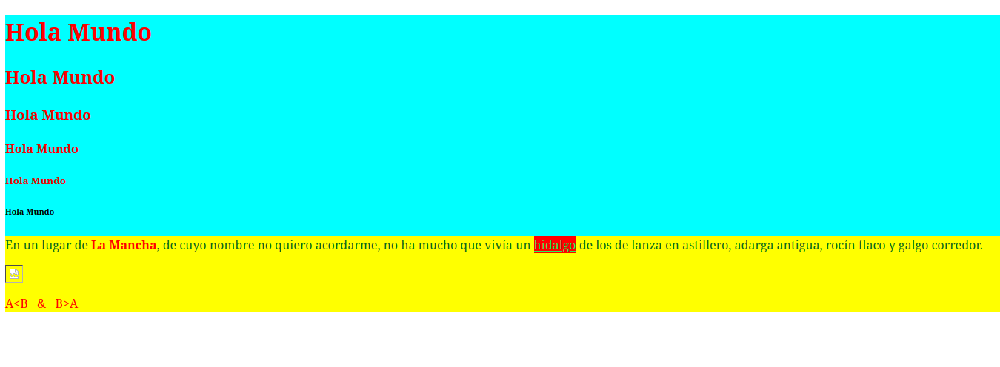
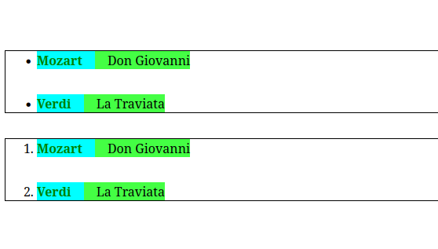
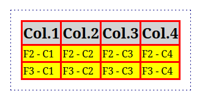
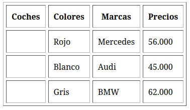
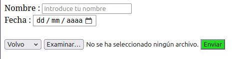
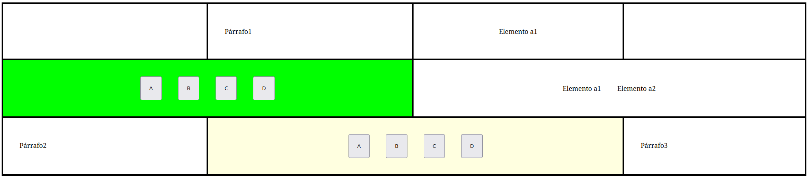
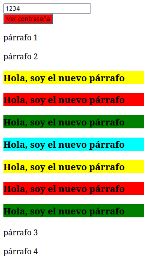

## Actividades

### Actividad 1
HTML básico, los primeros encabezados e imágenes. Trabajamos con los distintos tipos de <h> y las etiquetas más básicas. También introduciremos los **contenedores** `
` y alteraremos propiedades como su color de fondo con pequeñas pinceladas de CSS inline.
 

### Actividad 2
HTML básico, espaciado con `margin` y `padding`. Jugaremos con el espaciado para entender la diferencia entre **margin y padding** usando todo lo aprendido anteriormente.
 

### Actividad 3
HTML básico centrado en **tablas**. Aquí veremos las tablas por primera vez, aprendiendo a definirlas, y alterar sus propiedades con CSS.
 

### Actividad 4
HTML y CSS básico junto a **formularios** con la etiqueta `<form>` y método POST. Una introducción a formularios a la vez que avanzamos en CSS.
 

### Actividad 5
HTML y CSS, usamos propiedad `flex` y etiqueta `<grid>` con un diseño basado en **filas y columnas**. Avanzamos en contenedores jugando con la propiedad `display:` y sus valores `flex` y `grid` a la vez que hacemos nuestro primer external CSS en un archivo a parte.
 

### Actividad 6
Empezamos con JavaScript haciendo programas sencillos. Ejemplos de esto son calcular el **M.C.D**, mostrar y ocultar una contraseña o mostrar el **día de la semana** dada una fecha (hay varias versiones y pequeñas alteraciones que distan del objetivo del ejercicio por motivos explicativos de algunas funcionalidades de JavaScript).
 

